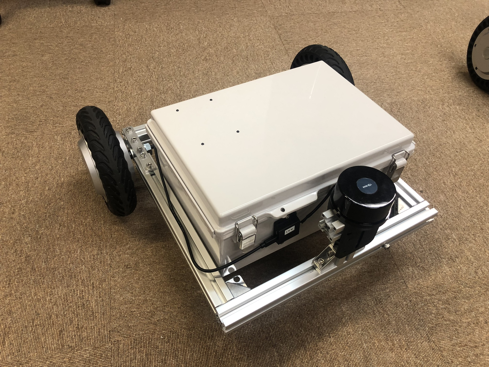
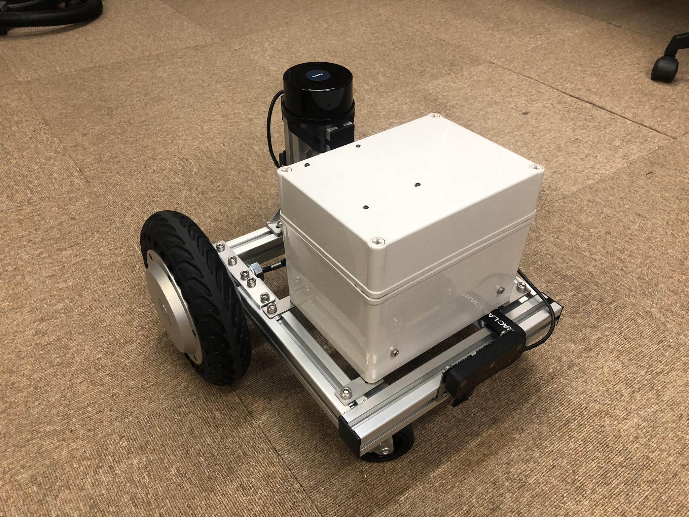

# ATCart8-Nav2-demo

A demonstration of ATCart8 with ROS2 Navigation2. Even this package is implemented in ROS2, but there are some scenarios that we need to use some package from ROS1, so please install ROS1 along side with this setup.

Regular size



Small size




## Dependencies

Please make sure to have these following packages install before,

You can install this `ZLAC8015D_python` package outside of ROS workspace, it could be at `/home/$USER`.

- https://github.com/rasheeddo/ZLAC8015D_python , please check on the [installation process](https://github.com/rasheeddo/ZLAC8015D_python#installation).


### ROS1

- install ROS1 ([noetic](http://wiki.ros.org/noetic/Installation/Ubuntu), recommended)

Assume that you have created the workspace as `catkin_ws`, after install the ROS1 debian package. Then clone this package to your `catkin_ws/src` and do `catkin_make` .

- https://github.com/YDLIDAR/ydlidar_ros_driver

### ROS2

- install ROS2 [Foxy](https://docs.ros.org/en/foxy/Installation.html).

- `sudo apt install ros-foxy-robot-localization`

- `sudo apt install ros-foxy-navigation2`

- `sudo apt install ros-foxy-nav2-bringup`

- `sudo apt install ros-foxy-slam-toolbox`

Assume that you have installed ROS2 and created the workspace as `dev_ws`. Then clone these packages to your `dev_ws/src` and do `colcon build --symlink-install` .

- https://github.com/YDLIDAR/ydlidar_ros2_driver

- https://github.com/attraclab/jmoab_ros2

- https://github.com/attraclab/atcart8_nav2_demo

- https://github.com/ros2/ros1_bridge , MUST build `ros1_bridge` as explained [here](https://github.com/ros2/ros1_bridge#building-the-bridge-from-source).


## Pretest

Let's make sure that we can have a fully control of ATCart8 and odometry published properly.

```sh
# Testing ATCart8, jmoab_ros2, ekf nodes

## Terminal1 (on Jetson)
source /opt/ros/foxy/setup.bash
source ~/dev_ws/install/local_setup.bash
ros2 launch atcart8_nav2_demo robot_without_laser.launch.py
### the cart should be able to contrtol by Futaba RC transmitter when in manual mode.

## Terminal2 (on PC)
source /opt/ros/foxy/setup.bash
source ~/dev_ws/install/local_setup.bash
rviz2
### open the config file from ~/dev_ws/src/atcart8_nav2_demo/rviz/ directory
### select odom_ekf_test.rviz
### you should be able to see two arrows of atcart8/odom and odometry/filtered topics
### the odometry/filtered one should estimate better than atcart8/odom once you move the bot for a while
```

```sh
# Testing ROS2 YDLidar laserscan

## Terminal1 (on Jetson)
source /opt/ros/foxy/setup.bash
source ~/dev_ws/install/local_setup.bash
ros2 launch atcart8_nav2_demo robot.launch.py
### the cart should be able to contrtol by Futaba RC transmitter when in manual mode.

## Terminal2 (on PC)
source /opt/ros/foxy/setup.bash
source ~/dev_ws/install/local_setup.bash
rviz2
### open the config file from ~/dev_ws/src/atcart8_nav2_demo/rviz/ directory
### select laserscan.rviz
### you should be able to see red dots of laserscan, if moving around it should change the orientation too.
```

```sh
# Testing ROS1 YDLidar laserscan and ros1_bridge ROS2

## Terminal1 (on Jetson)
source /opt/ros/noetic/setup.bash 
roscore

## Terminal2 (on Jetson)
source /opt/ros/noetic/setup.bash
source /opt/ros/foxy/setup.bash
source ~/dev_ws/install/local_setup.bash
ros2 run ros1_bridge dynamic_bridge

## Terminal3 (on Jetson)
source /opt/ros/noetic/setup.bash
source ~/catkin_ws/devel/setup.bash
roslaunch ydlidar_ros TG.launch

## Terminal4 (on PC)
source /opt/ros/foxy/setup.bash
rviz2
### open the config file from ~/dev_ws/src/atcart8_nav2_demo/rviz/ directory
### select laserscan.rviz
### you should see the laserscan similar to YDLidar ROS2

```

## Run

When changing new environment, we need to create new map of that environment, save the map, and use it for navigation later.
Here is the workflow.

### Making a map from slam_toolbox

```sh
### slam_toolbox requires a constant length of ranges in scan topics
### but ydlidar ros2 seems not be able to do so,
### please check on my issue report here
### https://github.com/YDLIDAR/ydlidar_ros2_driver/issues/15
### We need to use ydlidar_ros (ROS1) instead

## Terminal1 (on Jetson)
source /opt/ros/noetic/setup.bash
roscore

## Terminal2 (on Jetson)
source /opt/ros/noetic/setup.bash
source /opt/ros/foxy/setup.bash
source ~/dev_ws/install/local_setup.bash
ros2 run ros1_bridge dynamic_bridge

## Terminal3 (on Jetson)
source /opt/ros/noetic/setup.bash
source ~/catkin_ws/devel/setup.bash
roslaunch ydlidar_ros TG.launch

## Terminal4 (on Jetson)
source /opt/ros/foxy/setup.bash
source ~/dev_ws/install/local_setup.bash
ros2 launch atcart8_nav2_demo robot_without_laser.launch.py

## Terminal5 (on PC)
source /opt/ros/foxy/setup.bash
source ~/dev_ws/install/local_setup.bash
rviz2
### open the config file from ~/dev_ws/src/atcart8_nav2_demo/rviz/ directory
### select slam_mapping.rviz

## Terminal6 (on Jetson)
source /opt/ros/foxy/setup.bash
source ~/dev_ws/install/local_setup.bash
ros2 launch slam_toolbox online_async_launch.py slam_params_file:=/home/$USER/dev_ws/src/atcart8_nav2_demo/config/mapper_params_online_async.yaml


### on Rviz2 window, you should see the map slowly generate,
### we just need to move the bot to cover the area we want

## Terminal7 (on Jetson)
source /opt/ros/foxy/setup.bash
source ~/dev_ws/install/local_setup.bash
cd ~/dev_ws/src/atcart8_nav2_demo/map
ros2 run nav2_map_server map_saver_cli -f <map_name>
### if it shows error of timeout, please run map_saver again until it's complete saving.
```

### Navigation

```sh
### For Nav2, it seems to be okay to uuse ydlidar ros2
### no need to use ros1_bridge in this step
### but I found it's better to start nav2_bringup at the end to load the map properly

## Terminal1 (on Jetson)
source /opt/ros/foxy/setup.bash
source ~/dev_ws/install/local_setup.bash
ros2 launch atcart8_nav2_demo robot.launch.py

## Terminal2 (on PC)
source /opt/ros/foxy/setup.bash
source ~/dev_ws/install/local_setup.bash
rviz2
### open the config file from ~/dev_ws/src/atcart8_nav2_demo/rviz/ directory
### select nav2_default_view.rviz

## Terminal3 (on Jetson)
source /opt/ros/foxy/setup.bash
source ~/dev_ws/install/local_setup.bash
ros2 launch nav2_bringup bringup_launch.py use_sim_time:=False autostart:=True map:=/home/$USER/dev_ws/src/atcart8_nav2_demo/map/<your-map>.yaml params_file:=/home/$USER/dev_ws/src/atcart8_nav2_demo/config/nav2_params.yaml

### nav2_params.yaml is for original size atcart8
### nav2_params_smallCart.yaml is for small size atcart8

### Click on and drag on Navigation 2 Goal panel to send goal_pose to controller
```

## Issues

- With the large map, it seems that Rviz2 keeps crashing randomly, still have no idea why...

