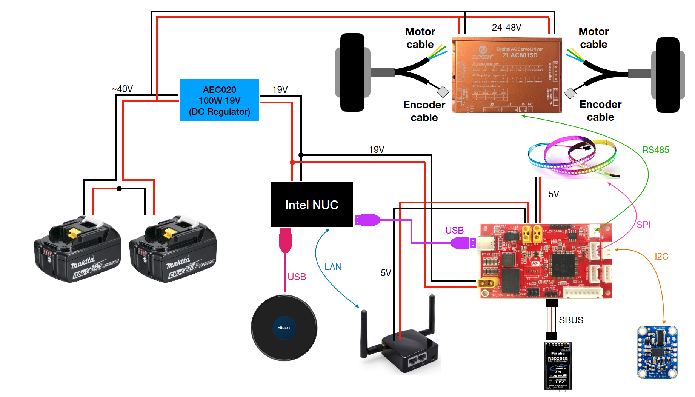
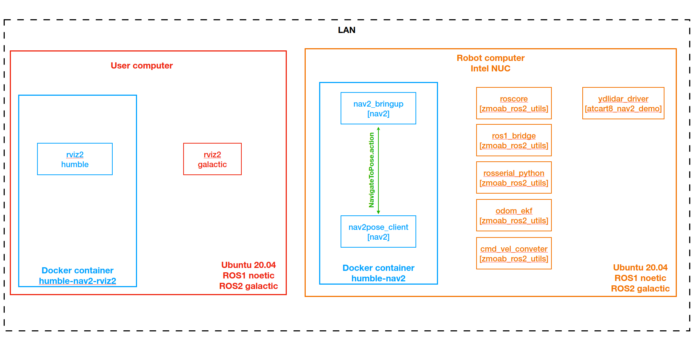
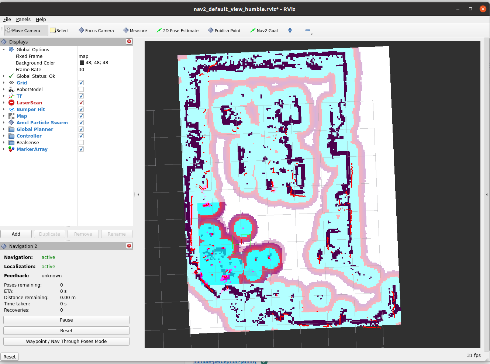

# Nav2 humble in Docker container

Because we need ROS1 for ZMOAB, and building ROS1 and `ros1_bridge` from source on ubuntu 22.04 is not that easy, you will be facing some error during build. So to use Navigation2 in humble is better run from docker container. We can still use Ubuntu 20.04 with ROS2 galactic and ROS1 noetic.

## Hardware

This is pretty much similar to setup in [NUC](./nuc.md), but we're going to install galactic instead and also docker-engine.

- Intel NUC
- AT_ZMOAB
- ZLAC8015D + a pair of 8inch motor
- YDLidar TG30
- Futaba RC receiver
- BNO055 IMU
- 19V DC regulator
- Battery from 24-48V
- WS2812b (optional for status indicator)

The cable connection is shown as following diagram, 



## Dependencies

Please make sure to have these following packages install before,

### Docker

Pleas check on [this link](https://docs.docker.com/engine/install/ubuntu/) to install Docker Engine,

You need to change group and allow to run docker without sudo [from this](https://docs.docker.com/engine/install/linux-postinstall/).

### ROS1

- install ROS1 ([noetic](http://wiki.ros.org/noetic/Installation/Ubuntu), recommended)

- `sudo apt install ros-noetic-rosserial-python`

### ROS2

- install ROS2 [Galactic](https://docs.ros.org/en/galactic/Installation.html).

- `sudo apt install ros-galactic-robot-localization`

- `sudo apt install ros-galactic-navigation2`

- `sudo apt install ros-galactic-nav2-bringup`

- `sudo apt install ros-galactic-slam-toolbox`

- `sudo apt install ros-galactic-nav2-simple-commander`

- `sudo apt install ros-galactic-tf-transformations`

- `sudo apt install python3-pip`

- `sudo pip3 install transforms3d`

Assume that you have installed ROS2 and created the workspace as `dev_ws`. Then clone these packages to your `dev_ws/src` and do `colcon build --symlink-install` .

- https://github.com/YDLIDAR/ydlidar_ros2_driver

- https://github.com/attraclab/zmoab_ros2_utils, check on the installation step of zmoab_ros2_utils as well.

- https://github.com/attraclab/atcart8_nav2_demo

- https://github.com/ros2/ros1_bridge , MUST build `ros1_bridge` as explained [here](https://github.com/ros2/ros1_bridge#building-the-bridge-from-source).

## Pretest

Let's make sure that we can have a fully control of ATCart8 and odometry published properly.

We need to start ZMOAB nodes to port ROS1 topics to ROS2, please check on the [step here](https://github.com/attraclab/zmoab_ros2_utils#run-manually).

```sh
# Testing Odometry and EKF from zmoab_ros2_utils

## Assume that all of ZMOAB nodes are running,

## Terminal1 (on PC)
source /opt/ros/galactic/setup.bash
source ~/dev_ws/install/local_setup.bash
rviz2
### open the config file from ~/dev_ws/src/atcart8_nav2_demo/rviz/ directory
### select odom_ekf_test.rviz
### you should be able to see red arrow which is atcart8/odom (original odom), 
### and also green arrow odometry/filtered (fused odom)
### if moving around it should change the orientation too.

```

```sh
# Testing ROS2 YDLidar laserscan

## Terminal1 (on NUC)
source /opt/ros/galactic/setup.bash
source ~/dev_ws/install/local_setup.bash
ros2 launch atcart8_nav2_demo ydlidar.launch.py

## Terminal2 (on PC)
source /opt/ros/galactic/setup.bash
source ~/dev_ws/install/local_setup.bash
rviz2
### open the config file from ~/dev_ws/src/atcart8_nav2_demo/rviz/ directory
### select laserscan.rviz
### you should be able to see red dots of laserscan, if moving around it should change the orientation too.
```

## Making a map

We can make a map in galactic similar to the step describe [here](https://github.com/attraclab/atcart8_nav2_demo/blob/master/docs/nuc.md#making-a-map-from-slam_toolbox). You just need to source environment from galactic instead of foxy.

Save the generated map on to your computer, you will need to copy it to docker container later.

## Docker

The reason we want to use nav2 humble because it's quite up-to-date, there are new sophisticated features, there is a simple-commander function to allow us to interact with nav2_bringup easily, and on galactic there is a bug where dynamic obstacle not getting avoid, so the robot just run pass through it :( .

But humble is only available officially on ubuntu 22.04, the only package we need from humble is Nav2 in humble distro, then we're going to start docker container just only nav2.

Let's look on below diagram for more detail, 



The orange box is the environment on robot NUC, there are nodes running on local ROS1 noetic and ROS2 galactic from `zmoab_ros2_utils` and `ydlidar_driver`, the blue container inside is Docker container which will be running nav2 humble related.

The red box is the environment on your PC, when you're making the map from `slam_toolbox` you can use ROS2 galactic as default, but when you want to visualize nav2 humble, you will need to run it in Docker.

And these two computers are in the same network.

## Build

First we need to build the images, on the robot NUC you will need to build humble-nav2 image which going to run nav2_bringup and nav2pose_client script, and on your PC you will need to build humble-nav2-rviz2 to visualize the nav2_bringup.

### On NUC

- `cd ~/dev_ws/src/atcart8_nav2_demo/docker/humble-nav2`

you will see file structure as following

```
├── Dockerfile
├── nav2
│   ├── config
│   │   └── nav2_params_humble.yaml
│   ├── map
│   │   ├── office.pgm
│   │   └── office.yaml
│   ├── scripts
│   │   └── nav2pose_client.py
│   └── startup
│       ├── start_nav2_bringup.sh
│       └── start_nav2pose.sh
└── ros_entrypoint.sh

```

- `Dockerfile` is a file to build docker `humble-nav2` image.
- `nav2_params_humble.yaml` is the config file to use with nav2_bringup
- `office.pgm and office.yaml` are map file, you will need to copy your map and paste here
- `nav2pose_client.py` is a simple action-client script to talk with `nav2_bringup` easily, this node will be run and it will subscribe on `target_point` topic as geometry_msgs/PoseStamped so you can publish a goal point to it one at a time

```sh
## For example try ros2 topic pub
## you can try this later, let's move on to building process
ros2 topic pub --once /target_point geometry_msgs/msg/PoseStamped "{header: {frame_id: 'map'}, pose: {position: {x: 3.0, y: 0.5}, orientation: {x: 0.0, y: 0.0, z: 0.0, w: 1.0}}}"

ros2 topic pub --once /target_point geometry_msgs/msg/PoseStamped "{header: {frame_id: 'map'}, pose: {position: {x: -1.0, y: -2.0}, orientation: {x: 0.0, y: 0.0, z: 0.0, w: 1.0}}}"
```

- `start_nav2_bringup.sh` and `start_nav2pose.sh` are bash scripts for our Docker endpoint when the container starts.
- `ros_entrypoint.sh` is a wrap-up of everything you want to run when container starts, the `start_nav2_bringup.sh` and `start_nav2pose.sh` will be executed inside. Later if you have anything to start in humble, you can add new startup script as well.

***TODO***
1. You will need to copy your map file to this map directory
2. inside of `start_nav2_bringup.sh` , you will need to change map name according to your map

After that let's build image file,
```sh
## To build image
cd ~/dev_ws/src/atcart8_nav2_demo/docker/humble-nav2

docker build -t humble-nav2 .
### it would take sometime to download original ros humble image from docker hub

### after it's done, try to check if there is images list
docker images
### you will see something like
### REPOSITORY    TAG                IMAGE ID       CREATED         SIZE
### humble-nav2   latest             3b7be6507383   2 hours ago     2.78GB
### ros           humble             ff722dedce2c   7 weeks ago     751MB

```

### On PC

In order to visualize nav2 humble you need humble distro as well, if your PC has humble distro then you may not need to do this, but if you are using ubuntu 20.04 like me please follow along,

- make sure you have docker engine installed as well
- make sure you have ros2 workspace as `~/dev_ws/src`, if not please change it to yours.
- `cd ~/dev_ws/src/atcart8_nav2_demo/docker/humble-nav2-rviz2`

you will see file structure as following

```
.
├── Dockerfile
└── nav2_default_view_humble.rviz

```

- `nav2_default_view_humble.rviz` will be used inside for rviz2 once container starts.

```sh
## To build image
cd ~/dev_ws/src/atcart8_nav2_demo/docker/humble-nav2-rviz2

docker build -t humble-nav2-rviz2 .
### it would take sometime to download original ros humble image from docker hub

### after it's done, try to check if there is images list
docker images
### you will see something like
### REPOSITORY                 TAG                IMAGE ID       CREATED         SIZE
### humble-nav2-rviz2          latest             6b2c83c89185   2 minutes ago   2.72GB

```

## Run

This step assumes,
- you have docker images of `humble-nav2` on robot NUC, and `humble-nav2-rviz2` on your PC.
- you have zmoab_ros2_utils packages running on the robot NUC
- you have confirmed odometry data is working correctly,

```sh
## On PC
## start docker images humble-nav2-rviz2 as "rviz2" container
xhost +
docker run -it --env="ROS_DOMAIN_ID=1" \
               --net=host --env="DISPLAY" \
               --env="QT_X11_NO_MITSHM=1" \
               --volume="/tmp/.X11-unix:/tmp/.X11-unix:rw" \
               --name rviz2 humble-nav2-rviz2 bash

## you are now inside rviz2 container
## source  ros2 env and start rviz2
source /opt/ros/humble/setup.bash
rviz2 -d nav2_default_view_humble.rviz

## you suppose to see rviz2 now
```

```sh
## On NUC
## start docker image humble-nav2 as "nav2" container
docker run -d --rm --net=host --env="ROS_DOMAIN_ID=1" --name nav2 humble-nav2
## we run nav2 container in detach mode, so the terminal will be free

## on the same terminal, let see the logs inside container
docker logs -f nav2
## this will be showing logs continuously

```

Wait a few seconds then you will see rviz2 is showing static map, and robot location.
You may notice some error printing out on rviz2 terminal like below, but you can ignore that as long as the robot location is updating properly, and you can navigate the robot.



```

[ERROR] [1675174565.075566333] [rviz2]: Could not load pixmap package://rviz_common/icons/move2d.svg -- using default cursor instead.
[ERROR] [1675174565.075569883] [rviz2]: Could not load pixmap package://rviz_common/icons/move_z.svg -- using default cursor instead.
[ERROR] [1675174565.075573289] [rviz2]: Could not load pixmap package://rviz_common/icons/zoom.svg -- using default cursor instead.
[ERROR] [1675174565.075576800] [rviz2]: Could not load pixmap package://rviz_common/icons/crosshair.svg -- using default cursor instead.
[ERROR] [1675174565.241674181] [rviz2]: Could not load pixmap package://rviz_common/icons/classes/Displays.svg
[ERROR] [1675174565.251121076] [rviz2]: Could not load pixmap package://rviz_common/icons/classes/Views.svg

or 

[INFO] [1675174566.751532138] [rviz]: Message Filter dropping message: frame 'laser_frame' at time 1675174564.680 for reason 'discarding message because the queue is full'
[INFO] [1675174567.071411676] [rviz]: Message Filter dropping message: frame 'laser_frame' at time 1675174565.076 for reason 'discarding message because the queue is full'
[INFO] [1675174567.343411117] [rviz2]: Trying to create a map of size 60 x 60 using 1 swatches
[ERROR] [1675174567.346213221] [rviz2]: Vertex Program:rviz/glsl120/indexed_8bit_image.vert Fragment Program:rviz/glsl120/indexed_8bit_image.frag GLSL link result : 
active samplers with a different type refer to the same texture image unit

or

[ERROR] [1675174744.178967781] [rviz2]: Lookup would require extrapolation into the future.  Requested time 1675174744.116570 but the latest data is at time 1675174744.115053, when looking up transform from frame [laser_frame] to frame [map]
[ERROR] [1675174744.273424717] [rviz2]: Lookup would require extrapolation into the future.  Requested time 1675174744.215378 but the latest data is at time 1675174744.213996, when looking up transform from frame [laser_frame] to frame [map]

```

On NUC, there are two bash scripts running as I mentioned before `start_nav2_bringup.sh` and `start_nav2pose.sh`. `nav2_bringup` launch file as you know is started, and the script in `~/dev_ws/src/atcart8_nav2_demo/docker/humble-nav2/nav2/scripts/nav2pose_client.py` is started. `nav2pose_client.py` is an option script which is making your higher application works easier. This node is an action-client of NavigateToPose.action from Navigation2.

You can try this,

```sh
## For example try ros2 topic pub
## send /target_point topic at point x: 3 y: 0.5
ros2 topic pub --once /target_point geometry_msgs/msg/PoseStamped "{header: {frame_id: 'map'}, pose: {position: {x: 3.0, y: 0.5}, orientation: {x: 0.0, y: 0.0, z: 0.0, w: 1.0}}}"

## send /target_point topic at point x: -1.0 y: -2.0
ros2 topic pub --once /target_point geometry_msgs/msg/PoseStamped "{header: {frame_id: 'map'}, pose: {position: {x: -1.0, y: -2.0}, orientation: {x: 0.0, y: 0.0, z: 0.0, w: 1.0}}}"

## Durinng navigation, you can cancel the task by
## this will cancel the current goal target point
ros2 topic pub --once /cancel_task std_msgs/msg/Bool "{data: True}"

## If you want to re-initialize home position
## you can try bring the robot to where its x: 0 y: 0 then run this
ros2 topic pub --once /set_init_pose std_msgs/msg/Bool "{data: True}"
```

You can make some application script by publishing these topics.
